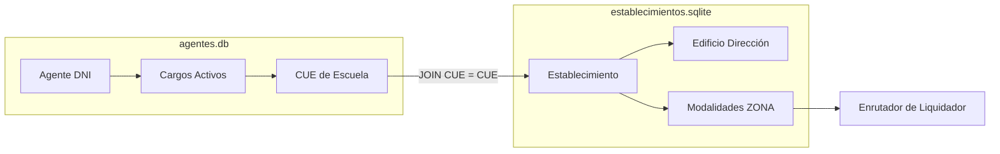

# Contexto Técnico y de Negocio: Asignaciones Familiares (AF)
### Bases de Datos de Agentes, Establecimientos y Enrutamiento por Zona

Este documento proporciona una guía de referencia estructurada sobre los esquemas, relaciones y reglas de negocio de las bases de datos de **Agentes** (`agentes.db` / tabla `agentes`) y **Establecimientos** (`establecimientos.sqlite` / tablas `establecimientos`, `edificios`, `modalidades`). 

El objetivo es facilitar la ingesta y el análisis semántico de esta información por herramientas de IA (como **NotebookLM**) y modelos de lenguaje (LLMs) para automatizar la interpretación de trámites y flujos de liquidación de Asignaciones Familiares.

---

## 1. Esquema Detallado de las Bases de Datos

### A. Base de Datos de Agentes (`agentes.db`)
Contiene el padrón de agentes activos y sus correspondientes cargos docentes o administrativos. Un agente (identificado por un único `dni`) puede desempeñarse en **múltiples cargos**.

*   **`dni` (TEXT / Clave de Consolidación):** Identificador absoluto del agente. Es la clave para consolidar (agrupar) la situación laboral total de un individuo.
*   **`nombre_agente` (TEXT):** Nombre completo del agente.
*   **`genero` (TEXT - `F` / `M`):** Género del agente. Campo crítico para verificar elegibilidad en asignaciones por **Maternidad** o **Estado Prenatal** (habitualmente asignado a la madre gestante).
*   **`legajo` (TEXT):** Código de identificación administrativa del empleado.
*   **`cue` (INTEGER - Clave Relacional):** **Clave Única de Establecimiento**. Identifica el colegio o dependencia física donde se desempeña ese cargo. Es el puente de unión directo con la base de establecimientos.
*   **`cupof` (TEXT):** Código Único de Planta Orgánica Funcional. Identifica la plaza presupuestaria exacta del cargo.
*   **`cargo_horas` (TEXT):** Nombre del puesto, asignatura o función (ej: "MAESTRO DE GRADO", "FÍSICA I").
*   **`horas_catedra` (INTEGER):** Cantidad de horas asociadas al cargo. Clave para evaluar topes estatutarios (límite de 50 Hs) y calcular proporcionalidad en asignaciones.
*   **`turno` (TEXT):** Turno de trabajo (`MAÑANA`, `TARDE`, `VESPERTINO`, `NOCHE`, `JORNADA COMPLETA`). Esencial para auditorías de superposición horaria física.
*   **`situacion_revista` (TEXT - `TITULAR`, `INTERINO`, `SUPLENTE`, `REEMPLAZANTE`):** Define la estabilidad laboral del cargo. Los cargos fijos permanentes son Titulares o Interinos.
*   **`fecha_alta` (TEXT - Formato `DD/MM/AAAA`):** Fecha de inicio del cargo. Determina la **retroactividad** del cobro de asignaciones familiares (el derecho se liquida desde la fecha de alta del agente o el nacimiento del menor, lo que sea posterior).
*   **`norma_legal` (TEXT):** Decreto o resolución oficial que avala el cargo.

### B. Base de Datos de Establecimientos (`establecimientos.sqlite`)
Contiene la estructura física y organizativa de las instituciones educativas. Está compuesta por tres tablas relacionales unificadas:

1.  **Tabla `establecimientos`:**
    *   **`cue` (INTEGER - Clave Primaria):** Clave Única de Establecimiento.
    *   **`nombre` (TEXT):** Nombre oficial del colegio.
    *   **`edificio_id` (INTEGER):** Relación con la infraestructura física.
2.  **Tabla `edificios`:**
    *   **`id` (INTEGER - Clave Primaria):** Vinculado a `edificio_id`.
    *   **`calle` / `numero_puerta` / `codigo_postal` / `localidad` (TEXT):** Dirección física del colegio.
    *   **`latitud` / `longitud` (REAL):** Coordenadas geográficas para cálculo de distancias de traslados.
    *   **`te_voip` (TEXT):** Teléfono IP oficial para comunicación y contacto directo del liquidador.
3.  **Tabla `modalidades`:**
    *   **`establecimiento_id` (INTEGER):** Vinculado a `establecimientos.id`.
    *   **`nivel_educativo` (TEXT):** Nivel (Primario, Secundario, Inicial, Superior).
    *   **`zona` (TEXT - Clave de Negocio):** **Zona de asignación presupuestaria y geográfica** (ej: "ZONA SUR", "ZONA NORTE", "ZONA RURAL", etc.). Es el campo clave para derivar el trámite al liquidador correspondiente.

---

## 2. La Relación CUE (El Puente Relacional)

La **Clave Única de Establecimiento (CUE)** es el puente que une la realidad del agente (su cargo) con la del establecimiento (su ubicación y zona geográfica).



### Consulta SQL Clave para Enrutamiento Semántico
Para que un LLM o un flujo automatizado asigne un trámite al liquidador de zona correcto, debe ejecutar el siguiente cruce:

```sql
SELECT 
    a.dni,
    a.nombre_agente,
    a.legajo,
    a.situacion_revista,
    a.cue,
    e.nombre as nombre_escuela,
    ed.localidad,
    ed.te_voip,
    m.zona as zona_escuela
FROM agentes a
LEFT JOIN establecimientos e ON a.cue = e.cue
LEFT JOIN edificios ed ON e.edificio_id = ed.id
LEFT JOIN modalidades m ON e.id = m.establecimiento_id
WHERE a.dni = :dni_solicitante;
```

---

## 3. Factibilidad y Reglas de Asignaciones Familiares (AF)

Para tramitar asignaciones familiares, el sistema necesita consolidar la información en perfiles unificados por DNI. A continuación se presentan las variables clave y su impacto en el negocio:

### A. Consolidación de Cargos y Horas (Determinación del Tramo de Ingresos)
Las asignaciones familiares se pagan según el **Tramo de Ingresos**. Alguien con múltiples cargos tiene múltiples sueldos. 
*   **Regla de Negocio:** El LLM debe agrupar los cargos del agente y sumar sus horas e ingresos estimados.
*   **Contexto a mostrar:**
    *   *Cantidad de Cargos Activos:* Mayor cantidad de cargos = mayor probabilidad de superar el tope máximo de ingresos permitidos para cobrar asignaciones.
    *   *Total de Horas Cátedra:* Si supera 50 horas, hay una **alerta de incompatibilidad estatutaria**, lo que suspende provisionalmente los trámites hasta regularizar la situación laboral.

### B. Estabilidad Laboral (`situacion_revista`)
*   **Titular / Interino (Cargos Fijos):** Derecho inmediato a percibir Asignaciones Familiares de forma regular mes a mes.
*   **Suplente / Reemplazante (Cargos Temporales):** El liquidador debe verificar mes a mes si el agente sigue prestando servicio efectivo para emitir el pago, o requerir la presentación de la "Declaración Jurada de Pluriempleo".

### C. Género (`genero`)
*   Crítico en los trámites de **Licencia por Maternidad** y **Asignación Prenatal**. El sistema debe validar que el género del solicitante se corresponda con las reglas de liquidación médica o matrimonio/unión civil declarada.

### D. Enrutamiento por Zona (`zona`)
*   Cada zona geográfica escolar cuenta con un **equipo de liquidadores especializados**. El sistema debe leer la `zona` de la escuela (desde `establecimientos.sqlite`) y transferir de forma automatizada la carpeta digital del agente al liquidador de esa misma zona.

---

## 4. Estructura Ideal de Datos (Contexto para LLM y NotebookLM)

Para que un modelo de lenguaje (como NotebookLM) procese de manera óptima un trámite de asignación familiar, la información consolidada del agente debe presentarse en un formato estructurado como el siguiente JSON. Esto le permite al LLM validar reglas de negocio en segundos:

```json
{
  "agente": {
    "dni": "28102938",
    "nombre": "GOMEZ, MARIA LAURA",
    "genero": "F",
    "legajo": "LEG-99238",
    "total_cargos_activos": 2,
    "total_horas_catedra": 18,
    "situacion_revista_predominante": "TITULAR",
    "fecha_alta_mas_antigua": "10/03/2021"
  },
  "cargos": [
    {
      "cue": 7000123,
      "establecimiento": "ESC. FRONTERA N. 10",
      "cargo": "MAESTRO DE GRADO",
      "horas": 0,
      "turno": "MAÑANA",
      "revista": "TITULAR",
      "fecha_alta": "10/03/2021",
      "zona_liquidadora": "ZONA RURAL NORTE"
    },
    {
      "cue": 7000456,
      "establecimiento": "COLEGIO SECUNDARIO N. 2",
      "cargo": "PROF. MATEMATICA",
      "horas": 18,
      "turno": "VESPERTINO",
      "revista": "INTERINO",
      "fecha_alta": "15/02/2023",
      "zona_liquidadora": "ZONA URBANA CENTRO"
    }
  ],
  "evaluacion_auditoria": {
    "exceso_horas_limite": false,
    "tiene_multicargo": true,
    "requiere_auditoria_traslado": true,
    "distancia_escuelas_km": 8.4,
    "conflictivo_por_turno": false
  }
}
```

---

## 5. Flujos de Trámites de Asignaciones Familiares

A continuación se describen los tres trámites más habituales y cómo la IA debe interpretar las bases de datos para validarlos:

### Flujo 1: Asignación por Hijo / Escolaridad
1.  **Solicitud:** El agente presenta partida de nacimiento y certificado de escolaridad del menor.
2.  **Validación de IA:**
    *   Busca el DNI del agente en `agentes.db`.
    *   Consolida sus sueldos. Valida si la suma del grupo familiar no supera el tope legal.
    *   Verifica si el agente tiene cargos activos y su `situacion_revista` (si es suplente, verifica continuidad de alta).
3.  **Enrutamiento:** Identifica el `cue` de su cargo principal, busca la `zona` en `establecimientos.sqlite` y deriva al liquidador asignado a esa zona para la firma digital del pago.

### Flujo 2: Asignación Prenatal / Maternidad
1.  **Solicitud:** Presentación de certificado médico de embarazo con fecha probable de parto (FPP).
2.  **Validación de IA:**
    *   Valida `genero` = `F` en `agentes.db`.
    *   Verifica la `fecha_alta` del agente. El derecho al cobro requiere que el agente estuviera en actividad al momento de la concepción.
    *   Consolida horas cátedra y situación de revista.
3.  **Enrutamiento:** Derivación por `zona` de establecimiento para liquidar los haberes médicos y retroactivos.

### Flujo 3: Auditoría de Pluriempleo e Incompatibilidad
1.  **Gatillo:** El agente solicita cobro de asignaciones y declara un solo cargo.
2.  **Validación de IA:**
    *   Busca el DNI en `agentes.db` y descubre que tiene **múltiples registros activos** con diferentes CUEs.
    *   Alerta si acumula cargos de planta y horas cátedra que choquen en turnos o distancias (auditoría geográfica mediante `establecimientos.sqlite`).
3.  **Resolución:** El LLM frena el trámite de AF de forma automática y emite una alerta indicando: *"Agente pluriempleado. Requiere consolidar haberes de todas las zonas identificadas antes de autorizar el cobro"*.
