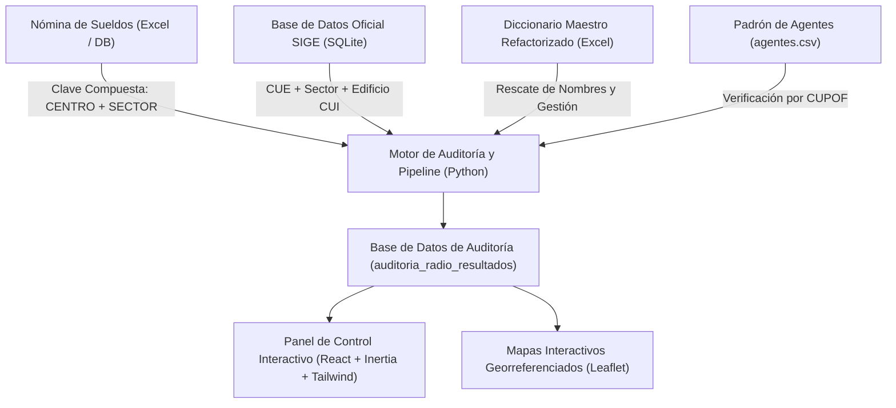

# Arquitectura del Sistema de Auditoría Salarial y Compensación Geográfica (EDU-Auditor)

**Sistema:** EDU-Auditor — Sistema de Auditoría de Compensación Geográfica y Haberes Docentes  
**Documento:** Especificación Técnica de Arquitectura, Modelo de Datos y Pipeline de Importación  
**Ubicación:** `doc/ARCHITECTURE.md`  

---

## 1. Visión General de la Arquitectura

EDU-Auditor es una plataforma integral de auditoría salarial, georreferenciación y saneamiento administrativo diseñada para el Ministerio de Educación de la Provincia de San Juan. Su propósito principal es cruzar la liquidación salarial mensual con la información oficial de establecimientos educativos (SIGE) y determinar la exactitud del adicional por compensación geográfica (**Radio Docente**).

---

## 2. Descubrimiento Clave de Dominio: Clave Compuesta `(CENTRO + SECTOR)`

### A. El Problema Histórico de Colisión
Históricamente, los sistemas de liquidación agrupaban los haberes utilizando únicamente el código de **`SECTOR`**. Esto generaba falsas colisiones y falsos sobrepagos porque un mismo número de sector (ejemplo: `Sector 2`) podía repetirse en diferentes dependencias salariales (como la Escuela Pública *Luis Jorge Fontana* vs la Escuela Privada *La Inmaculada*).

### B. Solución Técnica Implementada
El sistema opera mediante la clave unívoca compuesta:

$$\text{Identificador Unívoco de Liquidación} = \text{CENTRO} + \text{SECTOR}$$

* **SECTOR (Lugar o Presupuesto Físico/Funcional):** Identifica la escuela, anexo o dependencia presupuestaria (ej. `Sector 2`).
* **CENTRO (Repartición Liquidadora y Tipo de Agente):** Identifica la situación de revista y régimen de planta del personal.

### C. Catálogo de Centros Salariales de la Nómina

| Centro | Tipo de Agente / Repartición Liquidadora |
|---|---|
| **Centro 98** | Docentes **Titulares e Interinos en Cargos** |
| **Centro 19** | Docentes **Suplentes en Cargos** (Reemplazantes) |
| **Centro 80** | Personal **Transferido** (Cargos y Horas Cátedra Nivel Medio) |
| **Centro 85** | Docentes **Titulares e Interinos de Nivel Superior** |
| **Centro 63** | Agentes de **Enseñanza Privada** (Nivel Medio / Superior) |
| **Centro 64** | Agentes de **Enseñanza Privada** (Nivel Primario / Inicial) |
| **Centro 69** | Personal **Administrativo y de Servicios** |
| **Centro 53** | Personal **Político / Subsecretaría / Planeamiento** |

---

## 3. Triangulación de Fuentes de Verdad

El motor de auditoría ejecuta una triangulación entre tres fuentes principales:

1. **Base Oficial SIGE (`database/database.sqlite`)**:
   - `edificios`: Coordenadas geográficas, departamento, distancias y radios por ordenanza.
   - `establecimientos`: Nombre oficial y CUE de 9 dígitos.
   - `modalidades`: Ámbito (Público/Privado), nivel educativo y sector SIGE.
2. **Diccionario Maestro Refactorizado (`datos_csv/CENTROS Y SECTORES EDUCACION REFACTORIZADO (3).XLSX`)**:
   - Diccionario curado que contiene el 99,8% de coincidencia con la nómina salarial.
   - Rescata el nombre de establecimiento u oficina, el nivel y la gestión (Oficial vs Privada) para los sectores no enlazados.
3. **Padrón de Agentes (`datos_csv/agentes.csv`)**:
   - Mapeo unívoco de `CUPOF` que incluye el CUE de 9 dígitos para respaldar la asignación de plazas.

---

## 4. Pipeline de Importación Salarial (`scripts/importar_sueldos.py`)

El proceso de importación automatizada ejecuta los siguientes pasos:

1. **Agregación por Mediana de Alícuota:**
   Para cada grupo `(CENTRO, SECTOR, ZONA_SUELDO)`, calcula la relación porcentaje pagado:
   $$\text{Porcentaje Pagado (\%)} = \left( \frac{\text{A04 (Radio)}}{\text{A01 (Básico)}} \right) \times 100$$
   Se extrae la **mediana estadística** para eliminar ruidos por retroactivos o descuentos.
2. **Determinación del Radio Sueldo (1 al 7):**
   - Radio 1: $\le 45\%$
   - Radio 2: $46\% - 55\%$
   - Radio 3: $56\% - 85\%$
   - Radio 4: $86\% - 105\%$
   - Radio 5: $106\% - 125\%$
   - Radio 6: $126\% - 145\%$
   - Radio 7: $> 145\%$
3. **Cruzamiento y Clasificación:**
   - `COINCIDE_TOTAL`: Coincide el Radio Sueldo, Radio SIGE y los radios calculados por camino/circunscripción.
   - `COINCIDE_SIGE`: El Radio Sueldo coincide con el Radio oficial aprobado en SIGE.
   - `PAGA_MAS_QUE_SIGE`: La nómina liquida un radio mayor al aprobado legalmente.
   - `PAGA_MENOS_QUE_SIGE`: La nómina liquida un radio menor al aprobado legalmente.
   - `SIN_SIGE`: Sector de nómina sin vínculo directo a una escuela en SIGE (rescata automáticamente el nombre del Diccionario Refactorizado sin generar ruido).

---

## 5. Mantenimiento y Calidad de Código

El repositorio cuenta con pipelines automatizados de calidad:
* **JavaScript / React (Linter):** `npm run lint` (`eslint .`) configurado con `route` global y React 18 standards.
* **PHP (Linter / Formatter):** `./vendor/bin/pint` (Laravel Pint) para cumplimiento 100% de los estándares PSR-12/Laravel.
* **Pruebas Automatizadas Backend:** `php artisan test` (PHPUnit suite).
