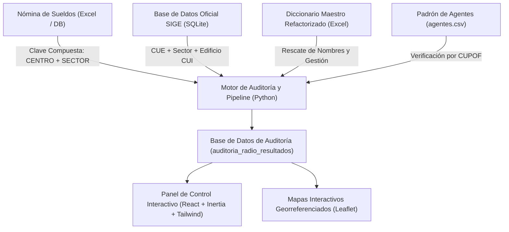

# Arquitectura del Sistema de Auditoría Salarial y Compensación Geográfica (EDU-Auditor)

**Sistema:** EDU-Auditor — Sistema de Auditoría de Compensación Geográfica y Haberes Docentes  
**Documento:** Especificación Técnica de Arquitectura, Modelo de Datos, Pipeline y Reglas de Interfaz  
**Ubicación:** `doc/ARCHITECTURE.md`  

---

## 1. Visión General de la Arquitectura

EDU-Auditor es una plataforma integral de auditoría salarial, georreferenciación y saneamiento administrativo diseñada para el Ministerio de Educación de la Provincia de San Juan. Su propósito principal es cruzar la liquidación salarial mensual con la información oficial de establecimientos educativos (SIGE) y determinar la exactitud del adicional por compensación geográfica (**Radio Docente**).

---

## 2. Descubrimiento Clave de Dominio: Clave Compuesta `(CENTRO + SECTOR)`

### A. El Problema Histórico de Colisión
Históricamente, los sistemas de liquidación agrupaban los haberes utilizando únicamente el código de **`SECTOR`**. Esto generaba falsas colisiones y falsos sobrepagos porque un mismo número de sector (ejemplo: `Sector 2`) podía repetirse en diferentes dependencias salariales (como la Escuela Pública *Luis Jorge Fontana* vs la Escuela Privada *La Inmaculada*).

### B. Solución Técnica Implementada
El sistema opera mediante la clave unívoca compuesta:

$$\text{Identificador Unívoco de Liquidación} = \text{CENTRO} + \text{SECTOR}$$

* **SECTOR (Lugar o Presupuesto Físico/Funcional):** Identifica la escuela, anexo o dependencia presupuestaria (ej. `Sector 2`).
* **CENTRO (Repartición Liquidadora y Tipo de Agente):** Identifica la situación de revista y régimen de planta del personal.

### C. Catálogo de Centros Salariales de la Nómina

| Centro | Tipo de Agente / Repartición Liquidadora |
|---|---|
| **Centro 98** | Docentes **Titulares e Interinos en Cargos** |
| **Centro 19** | Docentes **Suplentes en Cargos** (Reemplazantes) |
| **Centro 80** | Personal **Transferido** (Cargos y Horas Cátedra Nivel Medio) |
| **Centro 85** | Docentes **Titulares e Interinos de Nivel Superior** |
| **Centro 63** | Agentes de **Enseñanza Privada** (Nivel Medio / Superior) |
| **Centro 64** | Agentes de **Enseñanza Privada** (Nivel Primario / Inicial) |
| **Centro 69** | Personal **Administrativo y de Servicios** |
| **Centro 53** | Personal **Político / Subsecretaría / Planeamiento** |

---

## 3. Estructura de Navegación del Panel de Control (9 Pestañas)

La aplicación web React (`AuditoriaSueldos/Index.jsx`) se organiza en **9 pestañas principales** con navegación acordeón minimalista y sub-navegación interna:

1. **`Resumen & KPIs` (`kpi`):** Tarjetas de métricas globales, desvíos y distribución por radio.
2. **`Cruce Escuelas & Sectores` (`cruce`):** Matriz de relación principal entre escuelas SIGE y sectores de nómina.
3. **`Escalas & Residuales` (`escala`):** Auditoría de alícuotas históricas, porcentajes irregulares y Ley Paritaria.
4. **`Pagan MÁS` (`paga_mas`):** Sectores con sobrepago salarial respecto al radio legal en SIGE (`🔴 +1`, `🔴 +2`).
5. **`Pagan MENOS` (`paga_menos`):** Sectores con subpago salarial respecto al radio legal en SIGE (`🟡 -1`, `🟡 -2`).
6. **`Conflictos SIGE` (`conflictos`):** Sectores de la nómina asociados a CUEs con múltiples radios en el SIGE.
7. **`Inconsistencia Zona` (`zonas`):** Discrepancias entre departamento registrado en haberes vs edificio oficial.
8. **`Seguimiento & Gestión` (`tracking`):** Monitor de expedientes administrativos, dictámenes y resoluciones.
9. **`Otros Sectores` (`sin_escuela`):** Refactorizado en **3 Sub-Pestañas Especializadas**:
   - **🔍 Depuración de Catálogo:** Diagnóstico de Centros y Sectores sin uso en el catálogo Maestro vs Liquidación.
   - **🔗 Saneamiento & Vinculación CUE:** Sectores en liquidación que carecen de CUE asignado para vinculación o baja.
   - **⚠️ Residuales Huérfanos:** Registros con alícuotas históricas o irregulares sin escuela asociada.

---

## 4. Pipeline de Importación y Cálculo de Alícuotas (`scripts/importar_sueldos.py`)

1. **Agregación por Mediana de Alícuota:**
   Para cada grupo `(CENTRO, SECTOR, ZONA_SUELDO)`, calcula la relación porcentaje pagado:
   $$\text{Porcentaje Pagado (\%)} = \left( \frac{\text{A04 (Radio)}}{\text{A01 (Básico)}} \right) \times 100$$
   Se extrae la **mediana estadística** para eliminar ruidos por retroactivos o descuentos.

2. **Determinación del Radio Sueldo (R1 al R7):**
   - **R1:** $\le 45\%$
   - **R2:** $46\% - 55\%$
   - **R3:** $56\% - 85\%$
   - **R4:** $86\% - 105\%$
   - **R5:** $106\% - 125\%$
   - **R6:** $126\% - 145\%$
   - **R7:** $> 145\%$

3. **Clasificación de Escala:**
   - **`Ley Paritaria`**: Porcentajes oficiales vigentes ($40\%, 50\%, 60\%, 95\%, 115\%, 135\%, 155\%$).
   - **`Ley Histórica`**: Porcentajes anteriores ($20\%, 30\%, 40\%, 80\%, 100\%, 120\%, 140\%$).
   - **`Porcentaje Irregular`**: Porcentajes compuestos o descalibrados ($53.97\%, 104.08\%, 182.15\%$).

4. **Conteo Unívoco de Agentes:**
   - Las consultas backend agrupan por `(sector, cuil)` mediante `COUNT(DISTINCT cuil)` para garantizar el conteo exacto de **Liquidaciones** (agentes únicos afectados).

---

## 5. Mantenimiento y Calidad de Código

El repositorio cuenta con pipelines automatizados de calidad:
* **JavaScript / React (Linter):** `npm run lint` (`eslint .`) verificado con `0 errors`.
* **PHP (Linter / Formatter):** `./vendor/bin/pint` (Laravel Pint) para cumplimiento 100% de los estándares PSR-12/Laravel.
* **Pruebas y Build:** `npm run build` (Vite 8 bundle compilado sin errores).
