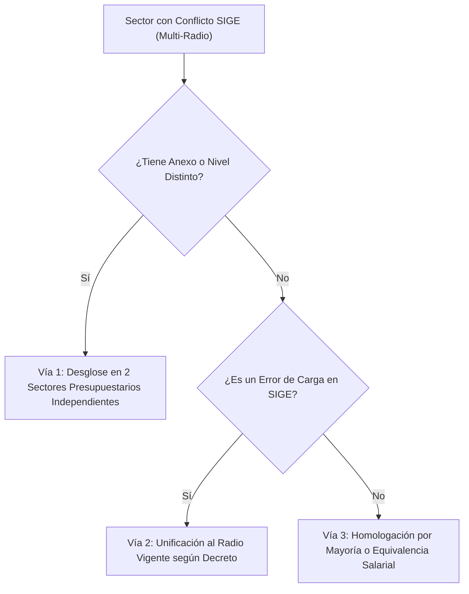

# Módulo de Saneamiento de Conflictos de Datos Internos SIGE

**Sistema:** EDU-Auditor — Sistema de Auditoría de Compensación Geográfica y Haberes Docentes  
**Documento:** Especificación Técnica y Funcional del Módulo de Conflictos Internos SIGE  
**Ubicación:** `doc/conflicos_sige.md`  

---

## 1. Definición del Problema

Un **Conflicto Interno SIGE** ocurre cuando **un mismo código de Sector Presupuestario (Sector SIGE)** tiene registradas múltiples modalidades o niveles educativos en la base de datos SIGE (`modalidades`), y a cada una de ellas se le ha asignado un **Radio oficial diferente**.

$$\text{Condición de Conflicto: } \text{COUNT}(\text{DISTINCT } \text{modalidades.radio FOR } \text{sector}) > 1$$

En la auditoría de la plataforma se identificaron **33 sectores presupuestarios** con esta ambigüedad interna (por ejemplo, el Sector 685 o Sector 768).

---

## 2. Origen Técnico de los Conflictos

1. **Sectores Compartidos entre Primaria y Secundaria:**
   Sectores donde una escuela primaria y una secundaria comparten el número de sector en SIGE, pero la norma legal aprobó un incremento de radio únicamente para el nivel secundario.
2. **Edificios con Anexos en Distintas Ubicaciones:**
   Escuelas donde la sede central funciona en zona urbana (Radio 1 o 2) y el anexo funciona en zona rural (Radio 4 o 5), pero ambas modalidades liquidan bajo el mismo sector presupuestario.
3. **Carga Duplicada o Equivalencias Normativas:**
   Sectores con equivalencias de alícuotas (ej. Radio 6 y Radio 7, que funcionalmente liquidan el 140% tope en haberes).

---

## 3. Resolución con Clave Compuesta `(CENTRO + SECTOR)`

Para evitar falsas alarmas, el sistema utiliza la clave compuesta **`CENTRO + SECTOR`**:
* **Sector SIGE:** Número de sector registrado en las modalidades del SIGE.
* **Sector Sueldos:** Número de sector auditado en la nómina de haberes.
* **Centro Salarial:** Código que identifica la repartición liquidadora (ej. Centro 98 para Titulares, Centro 19 para Suplentes, Centro 63 para Privadas).

---

## 4. Modal Interactivo de Detalle (Formato Expandido 2x)

Para permitir una auditoría profunda de los **33 sectores en conflicto**, la interfaz React cuenta con un **Modal de Detalle Expandido (`max-w-6xl`)** que despliega las siguientes columnas para cada establecimiento afectado:

| Columna | Descripción |
|---|---|
| **CUE** | Clave Única de Establecimiento (con enlace de edición `/admin/establecimientos`). |
| **Establecimiento / Escuela** | Nombre oficial de la institución educativa. |
| **Ámbito** | Badge visual (`PÚBLICO` o `PRIVADO`). |
| **Centro** | Centro salarial asociado (`Centro 98`, `Centro 19`, `Centro 80`, etc.). |
| **Sector SIGE** | Número de sector asignado en la base oficial del SIGE. |
| **Sector Sueldos** | Número de sector correspondiente en la nómina salarial. |
| **Radio SIGE** | Radio geográfico oficial asignado en SIGE (Radio 1 al 7). |
| **Radio Sueldo** | Radio determinado a partir de la mediana de liquidación de haberes. |
| **CUI Edificio** | Identificador del edificio físico (con enlace de edición `/admin/edificios`). |
| **Departamento** | Departamento geográfico de la Provincia de San Juan. |

---

## 5. Diagrama del Flujo de Saneamiento

