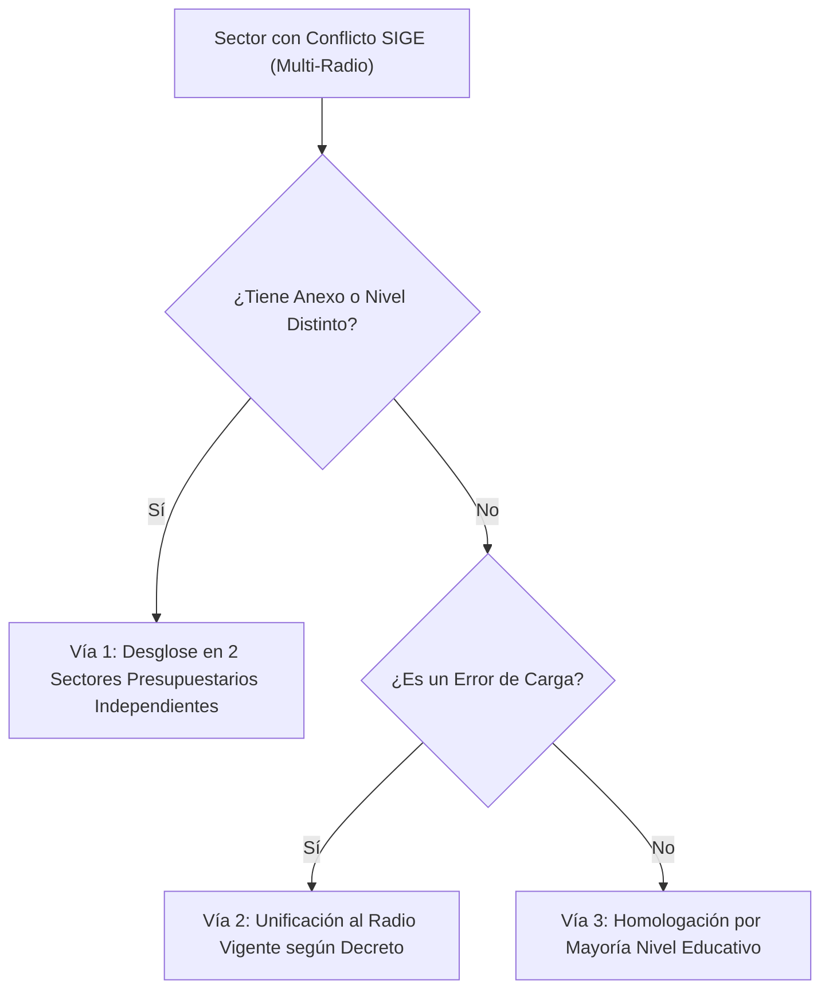

# Módulo de Saneamiento de Conflictos de Datos Internos SIGE

**Sistema:** EDU-Auditor — Sistema de Auditoría de Compensación Geográfica y Haberes Docentes  
**Documento:** Especificación Técnica y Funcional del Módulo de Conflictos Internos SIGE  
**Ubicación:** `doc/conflicos_sige.md`  

---

## 1. Definición del Problema

Un **Conflicto Interno SIGE** ocurre cuando **un mismo código de Sector Presupuestario (Sector A04)** tiene registradas múltiples modalidades o niveles educativos en la base de datos SIGE (`modalidades`), y a cada una de ellas se le ha asignado un **Radio oficial diferente**.

$$\text{Condición de Conflicto: } \text{COUNT}(\text{DISTINCT } \text{modalidades.radio FOR } \text{sector}) > 1$$

En la auditoría de la plataforma se identificaron **27 sectores presupuestarios** con esta ambigüedad interna.

---

## 2. Origen Técnico de los Conflictos

1. **Sectores Compartidos entre Primaria y Secundaria:**
   Sectores donde una escuela primaria y una escuela secundaria comparten el mismo número de sector, pero la norma legal aprobó un incremento de radio para el nivel secundario y no para el primario (o viceversa).
2. **Edificios con Anexos en Distintas Ubicaciones:**
   Escuelas donde la sede central está en un departamento central (Radio 1 o 2) y el anexo funciona en una zona rural (Radio 4 o 5), pero ambas modalidades liquidan bajo el mismo sector presupuestario.
3. **Carga Duplicada en SIGE:**
   Errores de tipeo en las normativas cargadas históricamente en el SIGE.

---

## 3. Ejemplos Reales de Conflictos Detectados

* **Sector 685 (La Chimbera / Fray Justo):**
  * *Nivel Primario / Adultos:* Radio 4
  * *Nivel Secundario:* Radio 5
  * *Efecto:* Docentes liquidados con el mismo sector presupuestario perciben radios distintos según la dirección de área.
* **Sector 768 (Albergue Josefa Ramírez):**
  * *Modalidad Albergue:* Radio 6
  * *Modalidad Primaria Común:* Radio 5

---

## 4. Estrategia de Resolución y Saneamiento

El módulo de **Conflictos SIGE** proporciona tres vías de solución:

---

## 5. Funcionalidades en el Panel de Auditoría

1. **Identificación Transparente (Pestaña "Conflictos SIGE"):**
   Muestra el listado de sectores en conflicto y la lista de radios distintos conviviendo en el SIGE para ese sector (ej. `Radio 1, Radio 4`).
2. **Establecimientos Relacionados mediante Modal:**
   Para evitar que la tabla principal se rompa o deforme debido a la cantidad y longitud de nombres de escuelas, se muestra la cantidad total de establecimientos en un botón interactivo. Al hacer clic, se despliega un **Modal de Detalles** estructurado con una tabla que detalla:
   * **CUE** (con enlace directo de edición administrativa a `/admin/establecimientos`).
   * **Nombre del Establecimiento / Escuela**.
   * **Ámbito** (badge visual indicando si es PÚBLICO o PRIVADO).
   * **Radio SIGE** asignado.
   * **CUI Edificio** (con enlace directo de edición administrativa a `/admin/edificios`).
   * **Departamento**.
3. **Consolidación Dinámica en Cliente (Deduplicación):**
   Debido a las restricciones de agregación múltiple en SQLite (`1 DISTINCT aggregates must have exactly one argument`), el backend agrupa la información básica separándola por delimitadores (`||` y `###`), y el cliente en React realiza dinámicamente la deduplicación e indexación por CUE, Radio y Ámbito para mostrar información precisa y detallada.
4. **Filtros Avanzados Aplicados:**
   Los conflictos pueden ser filtrados de forma reactiva en base a Departamento, Ámbito (Público/Privado) o un Radio específico en la barra global del panel.
