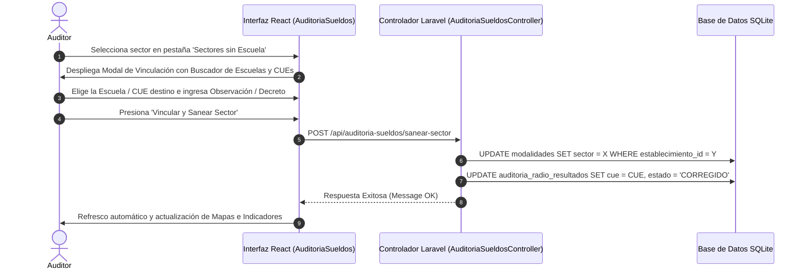

# Módulo de Saneamiento y Registro de Sectores Desvinculados

**Sistema:** EDU-Auditor — Sistema de Auditoría de Compensación Geográfica y Haberes Docentes  
**Documento:** Especificación Técnica y Funcional del Módulo de Saneamiento de Sectores  
**Ubicación:** `doc/saneamiento_sectores.md`  

---

## 1. Definición y Propósito

El módulo de **Saneamiento de Sectores** es una herramienta administrativa interactiva diseñada para resolver y vincular aquellos sectores presupuestarios A04 que en las cargas iniciales figuraban como **`SIN_SIGE`** o **"Sin Establecimiento Registrado"**.

---

## 2. Tipología de Sectores a Sanear

1. **Sectores de Escuelas Físicas Desvinculadas:**
   Sectores donde la escuela existe físicamente y dicta clases, pero el código de sector no estaba cargado en la tabla `modalidades`.
2. **Sectores de Cargos Volantes / Servicios Centrales:**
   Sectores correspondientes a Juntas de Clasificación, Supervisión, Gabinetes o Licencias, que requieren ser clasificados expresamente como "Cargos Centrales" para no ser buscados en el mapa geográfico.
3. **Escuelas Privadas Subvencionadas:**
   Sectores pertenecientes a colegios privados o parroquiales (ej. *Sector 911 - Monseñor Zapata*, *Sector 909 - Santa Teresita*).

---

## 3. Instructivo del Flujo de Vinculación Directa

El módulo permite al auditor ejecutar la vinculación en 3 sencillos pasos desde la pestaña **`Sectores sin Escuela`**:

---

## 4. Persistencia e Impacto Multinivel

Al sanear un sector mediante este módulo:
1. **Actualización de la Liquidación:** El sector queda vinculado al CUE y a la escuela en el Dashboard de Sueldos.
2. **Visualización en el Mapa Escolar (`/mapa`):** La escuela aparece georreferenciada con sus círculos de radio y distancia a la Plaza 25 de Mayo.
3. **Visualización en el Mapa Salarial (`/mapa-sueldos`):** El marcador de la escuela adquiere el código de color financiero (🟢 Coincide, 🟣 Sobrepago, 🔵 Subpago).
