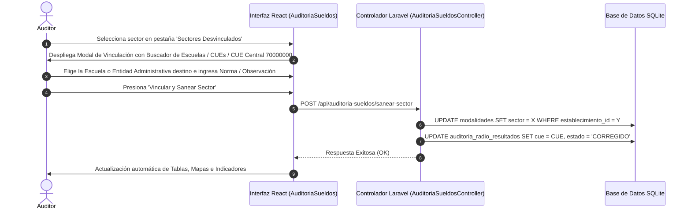

# Módulo de Saneamiento y Registro de Sectores Desvinculados

**Sistema:** EDU-Auditor — Sistema de Auditoría de Compensación Geográfica y Haberes Docentes  
**Documento:** Especificación Técnica y Funcional del Módulo de Saneamiento de Sectores  
**Ubicación:** `doc/saneamiento_sectores.md`  

---

## 1. Definición y Propósito

El módulo de **Saneamiento de Sectores** es una herramienta administrativa diseñada para identificar, nombrar y vincular aquellos **241 sectores presupuestarios** que en las cargas iniciales figuraban en la nómina salarial como **`SIN_SIGE`** o sin vínculo a un CUE de la base de datos oficial.

---

## 2. Radiografía y Clasificación de los 241 Sectores Desvinculados

Gracias al cruce inteligente entre el **Diccionario Maestro Refactorizado (`CENTROS Y SECTORES EDUCACION REFACTORIZADO (3).XLSX`)** y el padrón de agentes (`agentes.csv`), los 241 sectores desvinculados quedan desglosados en **3 tipologías operativas**:

### A. 🏛️ Oficinas Centrales, Juntas, Supervisores y Comisiones (46 Sectores)
* **Naturaleza:** Sectores salariales pertenecientes a agentes que **no laboran en un edificio escolar físico con alumnos**.
* **Ejemplos Reales:**
  - `Junta de Clasificación DESMYT` (Centro 94 - Sector 658)
  - `Supervisor Semi Residente` (Centro 94 - Sector 408)
  - `Gabinete Psicopedagógico Dr. Veronelli` (Centro 98 - Sector 224)
  - `Personal en Comisión de Servicio` (Centro 98 - Sector 227 / 570)
  - `Biblioteca del Magisterio` (Centro 98 - Sector 172)
* **Estrategia de Vinculación:** Se enlazan a la entidad administrativa central (**CUE `70000000` - Centro Cívico / Administración Central** o **CUE `70000001` - Cuerpo de Supervisores**), validando formalmente su liquidación bajo **Radio 1 (0% bonificación)**.

### B. 🏢 Colegios Privados no vinculados en SIGE (71 Sectores)
* **Naturaleza:** Sectores salariales de la educación privada o transferida (Centros `29`, `63`, `64`, `65`, `67`).
* **Ejemplos Reales:** `Colegio Merceditas de San Martín`, `Colegio San Pablo`, etc.
* **Estrategia de Vinculación:** Asignación directa del CUE de la institución privada registrada en la base de datos.

### C. 🏫 Escuelas Públicas, CENS, EPETs y Anexos (124 Sectores)
* **Naturaleza:** Establecimientos escolares reales cuyo campo `sector` en la tabla `modalidades` de SIGE no estaba cargado o figuraba como `0`.
* **Ejemplos Reales:** `C.E.N.S. Valle Fértil` (Centro 24/76 - Sector 602), `PROPAA Zona Sur Anexo 6` (Centro 80 - Sector 279), `Escuela Formación para Gestión Educativa` (Centro 85 - Sector 969).
* **Estrategia de Vinculación:** Selección del CUE correspondiente desde la herramienta interactiva de saneamiento.

---

## 3. Instructivo del Flujo de Vinculación Directa

---

## 4. Estructura de la Tabla en la Interfaz

La tabla de **Sectores Desvinculados** presenta una estructura limpia enfocada en radios e identificación física:

| Columna | Descripción |
|---|---|
| **Centro** | Código de Centro Salarial (`Centro 98`, `Centro 19`, `Centro 80`, etc.). |
| **Sector** | Número de sector presupuestario auditado. |
| **Estado Auditoría** | Estado de control (`SIN_SIGE`). |
| **Radio Sueldo** | Radio determinado por la mediana salarial. |
| **Personal Afectado** | Cantidad de agentes liquidados en el sector. |
| **Detalle / Notas** | Nombre refactorizado de la escuela u oficina y tipo de repartición. |
| **Acción Saneamiento** | Botón interactivo *"Vincular CUE"*. |
