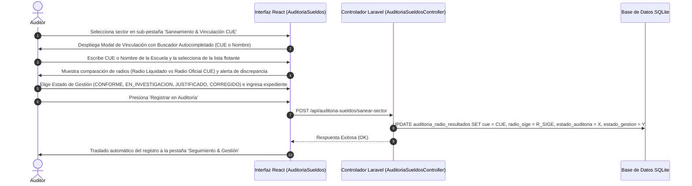

# Módulo de Saneamiento y Registro de Otros Sectores (Desvinculados)

**Sistema:** EDU-Auditor — Sistema de Auditoría de Compensación Geográfica y Haberes Docentes  
**Documento:** Especificación Técnica y Funcional del Módulo de Saneamiento e Investigación de Otros Sectores  
**Ubicación:** `doc/saneamiento_sectores.md`  

---

## 1. Definición y Propósito

El módulo de **Otros Sectores** es una herramienta administrativa y de depuración estructurada en **3 Sub-Pestañas Especializadas** dentro de `AuditoriaSueldos/Index.jsx`:

1. **🔍 Depuración de Catálogo (`depuracion`):**
   - Cruzamiento automatizado del Catálogo Maestro Refactorizado de Centros y Sectores vs la Liquidación de Sueldos.
   - Contiene 4 botones métricos inline (*🔴 Centros Sin Uso*, *⚠️ No Catalogados*, *🟡 Sectores Sin Uso*, *🟢 Activos*) directamente en la línea de título, maximizando el espacio vertical útil.
   - Incluye paginación fluida de 17 registros por página (`<Pagination>`), filtrado de observaciones limpias (removiendo prefijos redundantes y permitiendo formato multilínea sin cortar texto) y exportación a Excel.

2. **🔗 Saneamiento & Vinculación CUE (`saneamiento`):**
   - Agrupa los sectores activos en liquidación que carecen de establecimiento escolar (CUE) asignado en la base de datos oficial SIGE.
   - Permite vincular el sector a un CUE escolar oficial o registrar la baja administrativa.

3. **⚠️ Residuales Huérfanos (`residuales`):**
   - Muestra exclusivamente las liquidaciones con alícuotas históricas o irregulares que no poseen CUE asociado.
   - Permite dictaminar (Justificado Legal, Error Liquidación, Caso Especial) y cargar el decreto de aval.

---

## 2. Principio Fundamental: Aislamiento del Padrón Oficial SIGE

> [!IMPORTANT]
> **Preservación de la Base Oficial de SIGE:**
> * Al presionar **"Vincular a CUE"**, la acción **NO altera la tabla `modalidades`** ni modifica el sector oficial registrado para la escuela en la base administrativa de SIGE.
> * La vista oficial de establecimientos (`/admin/establecimientos`) permanece 100% protegida e inalterada.
> * La relación se asienta exclusivamente en el **Historial de Auditoría de Sueldos** (`auditoria_radio_resultados`), asociando el CUE destino, el radio oficial, la nota del auditor y la evaluación de discrepancia de radio.

---

## 3. Instructivo del Flujo de Vinculación y Traslado Automático

---

## 4. Estándares de Interfaz y Formato de Tabla

* **Encabezados de Tabla:** Color Naranja Institucional (`bg-[#FE8204] text-white font-black uppercase text-[11px]`).
* **Columna de Recibos/Agentes:** Nombre oficial **`Liquidaciones`**.
* **Badges de Centro Salarial:** Píldora naranja compacta (`98`, `19`, `80`, `63`).
* **Borde de Tarjeta:** Contenedor blanco limpio sin bordes laterales gruesos (`GlassCard className="p-6"`).
