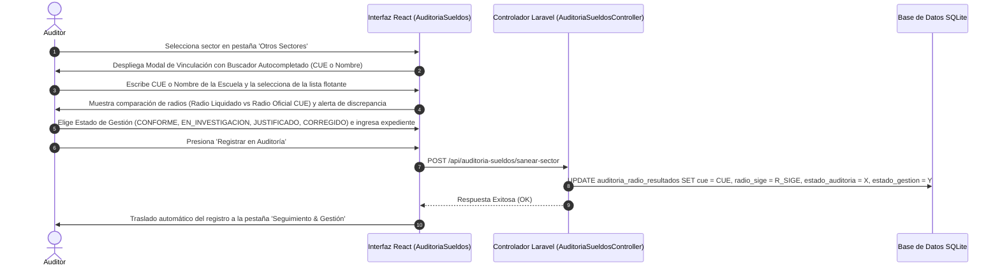

# Módulo de Saneamiento y Registro de Otros Sectores (Desvinculados)

**Sistema:** EDU-Auditor — Sistema de Auditoría de Compensación Geográfica y Haberes Docentes  
**Documento:** Especificación Técnica y Funcional del Módulo de Saneamiento e Investigación de Otros Sectores  
**Ubicación:** `doc/saneamiento_sectores.md`  

---

## 1. Definición y Propósito

El módulo de **Otros Sectores** (anteriormente *Sectores sin Escuela* / *Sectores sin Identificarse*) es una herramienta administrativa diseñada para investigar, nombrar y vincular aquellos sectores presupuestarios de la nómina salarial que inicialmente no registraban un CUE asociado en la base oficial.

---

## 2. Principio Fundamental: Aislamiento del Padrón Oficial SIGE

> [!IMPORTANT]
> **Preservación de la Base Oficial de SIGE:**
> * Al presionar **"Vincular a CUE"**, la acción **NO altera la tabla `modalidades`** ni modifica el sector oficial registrado para la escuela en la base administrativa de SIGE.
> * La vista oficial de establecimientos (`/admin/establecimientos`) permanece 100% protegida e inalterada, evitando duplicados o deformaciones en la estructura física del padrón.
> * La relación se asienta exclusivamente en el **Historial de Auditoría de Sueldos** (`auditoria_radio_resultados`), asociando el CUE destino, el radio oficial, la nota del auditor y la evaluación de discrepancia de radio.

---

## 3. Instructivo del Flujo de Vinculación y Traslado Automático

---

## 4. Características de la Interfaz

1. **Buscador en Tiempo Real por Autocompletado:**
   - Permite escribir el CUE de 9 dígitos (ej. `700069900` o `700031401`) o el nombre de la institución (ej. `Nicomedes`, `Kenney`).
   - Muestra de forma instantánea una lista flotante con las escuelas coincidentes, indicando CUE, departamento y Radio SIGE oficial.
2. **Comparación de Radios en Tiempo Real:**
   - Al seleccionar la escuela, el modal evalúa el `Radio Liquidado en el Sector` contra el `Radio SIGE Oficial`.
   - Si los radios difieren, despliega un aviso: `⚠️ Este sector liquida un radio distinto al CUE oficial. Se registrará la discrepancia para auditoría.`
3. **Estados de Gestión Disponibles:**
   - **`CONFORME`**: Para sectores pertenecientes a la escuela sin discrepancia de radio.
   - **`EN_INVESTIGACION`**: Para sectores en proceso de análisis de expediente.
   - **`JUSTIFICADO`**: Para sectores respaldados por norma legal o resolución.
   - **`CORREGIDO`**: Para sectores rectificados en liquidaciones.
   - **`PENDIENTE`**: Estado inicial sin revisar.
4. **Traslado Automático:**
   - Al confirmar el registro, el sector recibe su CUE y se traslada automáticamente al panel de **Seguimiento y Gestión**, donde permanece accesible para filtrado, edición y exportación a Excel.
