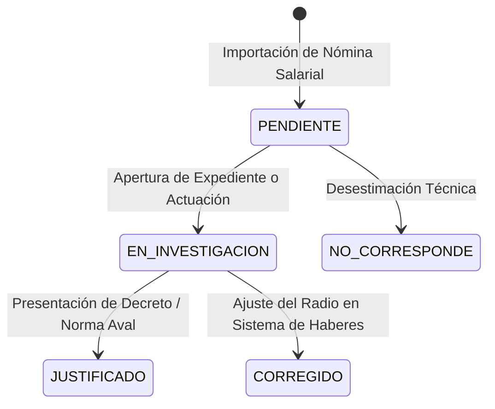

# Módulo de Seguimiento y Gestión Administrativa de Auditorías

**Sistema:** EDU-Auditor — Sistema de Auditoría de Compensación Geográfica y Haberes Docentes  
**Documento:** Especificación Técnica y Funcional del Módulo de Seguimiento de Gestión  
**Ubicación:** `doc/seguimiento_gestion.md`  

---

## 1. Propósito y Ciclo de Vida de la Gestión

El módulo de **Seguimiento & Gestión** permite a los auditores y funcionarios del Ministerio de Educación realizar el seguimiento de cada sector presupuestario que requiere intervención o ajuste administrativo.

---

## 2. Estructura de la Tabla de Seguimiento

La tabla de **Seguimiento & Gestión** permite la edición en tiempo real de cada expediente:

| Columna | Descripción |
|---|---|
| **Centro** | Código del Centro Salarial (`Centro 98`, `Centro 19`, `Centro 80`, etc.). |
| **Sector** | Número del sector presupuestario. |
| **Establecimiento** | Nombre de la escuela o repartición. |
| **Nivel** | Nivel educativo (Primaria, Secundaria, Superior, etc.). |
| **Radio SIGE** | Radio oficial en la base administrativa SIGE. |
| **Radio Sueldo** | Radio determinado por la mediana de liquidación de haberes. |
| **Estado Auditoría** | Estado de control (`COINCIDE`, `PAGA_MAS`, `PAGA_MENOS`, `SIN_SIGE`). |
| **Estado Gestión** | Combo interactivo (`PENDIENTE`, `EN_INVESTIGACION`, `JUSTIFICADO`, `CORREGIDO`). |
| **Notas del Auditor** | Campo de texto para asentar actuaciones administrativas o expedientes. |
| **Acciones** | Botón para guardar o actualizar el estado en la base de datos SQLite. |
