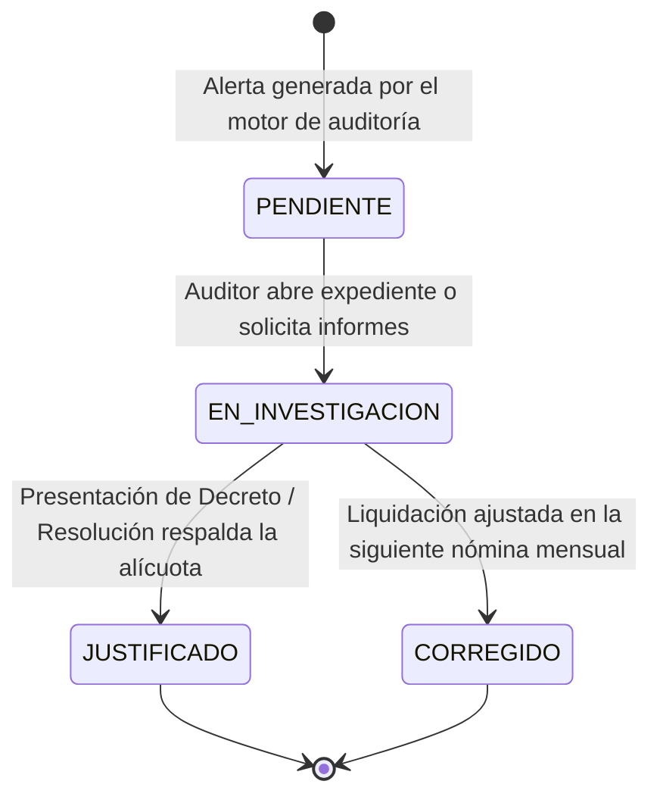

# Módulo de Seguimiento, Gestión del Ciclo de Vida y Auditoría Temporal

**Sistema:** EDU-Auditor — Sistema de Auditoría de Compensación Geográfica y Haberes Docentes  
**Documento:** Especificación Técnica y Funcional del Módulo de Seguimiento y Gestión  
**Ubicación:** `doc/seguimiento_gestion.md`  

---

## 1. Definición y Enfoque

El módulo de **Seguimiento y Gestión** proporciona el marco de gobernanza y control del ciclo de vida para la totalidad de las observaciones detectadas en las liquidaciones salariales A04.

Transforma una simple consulta de datos en un **workflow activo de auditoría estatal**, permitiendo que los auditores gestionen progresivamente las alertas hasta su resolución definitiva.

---

## 2. Ciclo de Vida del Estado de Gestión

Cada sector observado transita por los siguientes 4 estados reglamentarios:

| Estado | Significado Técnico y Operativo | Color Visual |
| :--- | :--- | :---: |
| **`PENDIENTE`** | Alerta recién detectada por el sistema. Requiere revisión. | ⚪ Gris |
| **`EN_INVESTIGACION`** | Solicitud de expediente a la Dirección de Personal / Paritarias. | 🟡 Ámbar |
| **`JUSTIFICADO`** | El porcentaje atípico está respaldado por Decreto o Norma Legal. | 🟣 Morado |
| **`CORREGIDO`** | El sobrepago o subpago fue ajustado en el sistema de haberes. | 🟢 Verde |

---

## 3. Registro de Trazabilidad, Filtros y Vista del Auditor

Para facilitar el análisis in situ del desvío, la tabla de Seguimiento y Gestión expone toda la información requerida:
1. **Detalle del Sector y Escuela:** Nombre del establecimiento y su CUE.
2. **Nivel Educativo / Dirección de Área:** Identifica la procedencia institucional del cargo (Inicial, Primaria, Secundaria, Técnica, Adultos, Privada).
3. **Contraste de Radios en Tiempo Real:** Exposición clara de la incongruencia (**Radio SIGE** vs **Radio Sueldo A04**) que justifica el estado de la alerta (ej. *Radio SIGE 1* vs *Radio Sueldo 3* para sectores con `PAGA_MAS_QUE_SIGE`).
4. **Filtro de Estado de Auditoría:** Permite filtrar la grilla en tiempo real por el tipo de alerta (ej. ver solo los subpagos o los sectores sin registro SIGE).
5. **Modal de Edición Rápida:** Permite cambiar el estado de gestión con un clic.
6. **Notas del Auditor / Expediente:** Registro en texto libre para detallar el número de actuación administrativa (ej. *Expediente N° 300-4512-2026 / Dictamen Fiscalía de Estado*).
7. **Persistencia Histórica:** Toda anotación queda guardada en la base de datos vinculada a la nómina auditada.

---

## 4. Métricas e Indicadores de Avance del Equipo Auditores

En el panel superior del Dashboard (`/auditoria-sueldos`), los KPI se actualizan en tiempo real reflejando:
* Porcentaje de sectores saneados vs pendientes.
* Monto acumulado recuperado o ajustado.
* Historial comparativo entre nóminas mensuales consecutivas.
