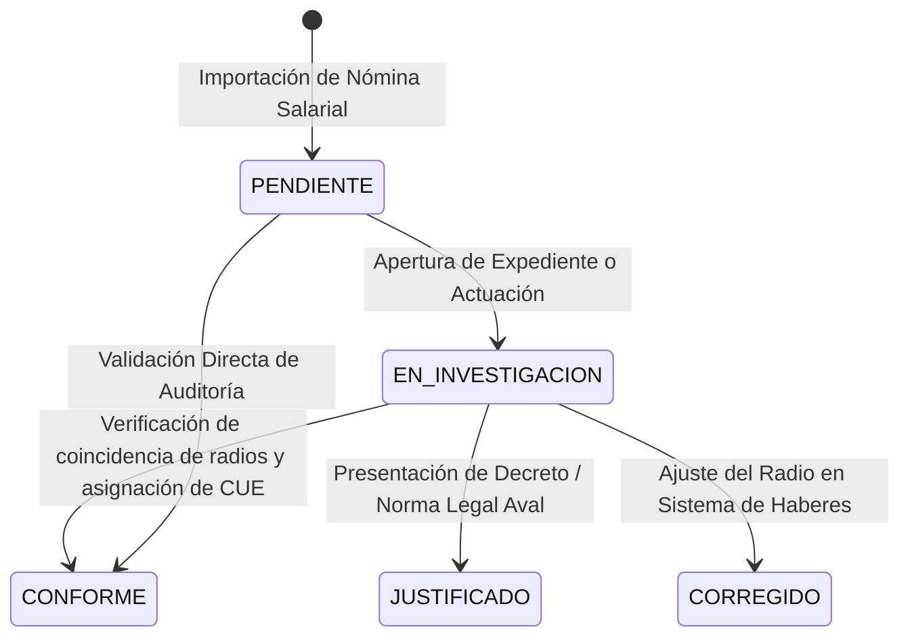

# Módulo de Seguimiento y Gestión Administrativa de Auditorías

**Sistema:** EDU-Auditor — Sistema de Auditoría de Compensación Geográfica y Haberes Docentes  
**Documento:** Especificación Técnica y Funcional del Módulo de Seguimiento de Gestión  
**Ubicación:** `doc/seguimiento_gestion.md`  

---

## 1. Propósito y Ciclo de Vida de la Gestión

El módulo de **Seguimiento & Gestión** centraliza el monitoreo y control de todos los sectores presupuestarios vinculados a establecimientos educativos (tanto los originales de SIGE como los saneados en auditoría). Permite evaluar la concordancia de radios geográficos y mantener la trazabilidad de actuaciones administrativas o expedientes.

---

## 2. Estructura y Herramientas del Panel

La tabla de **Seguimiento & Gestión** cuenta con cabecera Naranja Institucional (`bg-[#FE8204] text-white font-black`) e interactividad completa:

| Columna | Descripción |
|---|---|
| **Centro** | Badge naranja con el código de Centro Salarial (`98`, `19`, `80`, `63`, etc.). |
| **Sector** | Número del sector presupuestario auditado. |
| **Establecimiento** | Nombre de la escuela o repartición asociada. |
| **Radio SIGE** | Radio oficial en la base administrativa SIGE (**`R1`** al **`R7`**). |
| **Radio Sueldo** | Radio determinado por la mediana de liquidación de haberes (**`R1`** al **`R7`**). |
| **Coincide SIGE vs Sueldo** | Badge dinámico que evalúa coincidencia (`🟢 SI`, `🔴 +1`, `🟡 -1`). |
| **% Pagado** | Alícuota mediana porcentual efectivamente liquidada. |
| **Escala Detectada** | Badge de escala (`Ley Paritaria`, `Ley Histórica`, `Porcentaje Irregular`). |
| **Liquidaciones** | Cantidad de liquidaciones de haberes registradas (`COUNT(DISTINCT cuil)`). |
| **Estado Gestión** | Estado administrativo (`CONFORME`, `PENDIENTE`, `EN_INVESTIGACION`, `JUSTIFICADO`, `CORREGIDO`). |
| **Acciones** | Botón para editar estado, expediente y notas de auditoría. |

---

## 3. Estados de Gestión y Significado Operativo

* **`CONFORME` (Badge Azul 🔵):** El sector pertenece legítimamente a la institución y su radio pagado coincide con el radio oficial SIGE del CUE (sin inconsistencias).
* **`EN_INVESTIGACION` (Badge Amarillo 🟡):** El sector presenta discrepancias de radio o requiere verificación documental.
* **`JUSTIFICADO` (Badge Violeta 🟣):** La alícuota diferenciada está amparada por norma legal, decreto o resolución de la autoridad educativa.
* **`CORREGIDO` (Badge Verde 🟢):** El desvío salarial fue notificado y rectificado por la Dirección de Liquidaciones.
* **`PENDIENTE` (Badge Gris ⚪):** Registro nuevo sin revisión por el equipo auditor.
